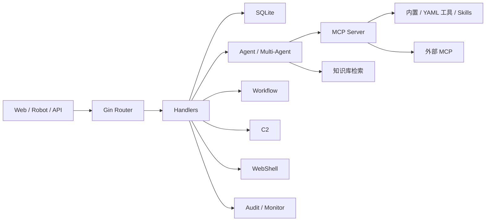

# 系统架构说明

## 1. 总体架构概览

- **核心形态**：单体 Go 进程 + SQLite + 静态 Web 前端；Agent 与 MCP 工具同进程编排
- **主要组成部分**：
  - **接入层**：Web UI、`/api/*`、机器人回调、OpenAPI（`/api-docs`）
  - **编排层**：Eino 单 Agent / Deep / Plan-Execute / Supervisor 多 Agent（`internal/multiagent/`）
  - **工具层**：内置 MCP Server、YAML 命令工具（`tools/`）、Skills FS、外部 MCP 联邦
  - **数据与状态**：SQLite、项目事实黑板（`internal/project/`）、工作流状态（`internal/workflow/`）
  - **治理层**：RBAC（`internal/security/`）、HITL（`internal/hitl/`）、审计（`internal/audit/`）、监控（`internal/monitor/`）
- **关键依赖关系**：用户请求 → Gin 路由 → Handler →（Agent → MCP 工具 / 知识库 / 工作流）→ SQLite；工具调用可插入 HITL，结果写入监控与对话过程详情

架构详图与模块列表见 `docs/zh-CN/architecture.md`。

## 2. 分层与职责

| 层级 | 目录 / 位置 | 职责 |
| :--- | :--- | :--- |
| 入口层 | `cmd/server/` | 进程入口、配置加载 |
| 组装层 | `internal/app/` | 依赖注入、路由注册（`app.go`）、MCP 内置工具注册（`*_tools.go`） |
| Handler 层 | `internal/handler/` | HTTP 参数校验、鉴权后业务协调、SSE/JSON 响应 |
| Agent 层 | `internal/agent/`、`internal/multiagent/`、`agents/`（Markdown 子 Agent） | 模型调用、工具循环、流式事件、检查点与恢复 |
| 工具层 | `internal/mcp/`、`internal/einomcp/`、`tools/`、`skills/` | 工具 schema、执行、超时、外部 MCP 连接恢复 |
| 工作流 | `internal/workflow/` + `handler/workflow*.go` | 图编排：start、agent、tool、condition、hitl、output、end |
| 知识库 | `internal/knowledge/` | 文档加载、分块、embedding、向量检索、rerank |
| 数据层 | `internal/database/` | 表结构、迁移、查询封装 |
| 视图 / 交互层 | `web/templates/`、`web/static/` | 无构建链路的静态 UI；i18n 在浏览器端 |

Handler **不应**承载复杂 Agent 循环逻辑；Agent **不应**直接写 HTTP 响应。

## 3. 主要边界

| 边界类型 | 说明 |
| :--- | :--- |
| 模块边界 | 业务按 `handler` 文件拆分；新增能力需同步考虑 database / openapi / 前端 / 审计 |
| 服务边界 | 外部 MCP、机器人平台、LLM API 为进程外依赖；失败需可恢复、可观测 |
| 数据边界 | 对话与业务数据在 `conversations.db`；知识向量在 `knowledge.db`（路径可由配置指定） |
| 外部系统边界 | 授权目标系统、IM 机器人、Burp/浏览器插件、独立 `mcp-servers/` 进程 |

## 4. 关键调用路径

### 4.1 典型对话流（SSE）

以 `/api/eino-agent/stream` 为例（见 `docs/zh-CN/architecture.md`）：

1. 认证中间件 → Handler 解析会话、角色、附件
2. 组装模型输入（历史、角色提示、**项目事实**、工具列表）
3. Eino Runner 调模型 → 工具调用经 MCP → 可选 **HITL 审批**
4. 工具结果写入过程详情与 **Monitor**
5. SSE 推送进度/工具事件/文本增量 → 持久化消息到 SQLite

故障可能出现在任一层：认证、会话、模型、工具、HITL、MCP、DB、SSE、前端。

### 4.2 高频改动主路径

- 新 API：`handler` → `database` → `app.go` 注册 → `openapi.go` → `web/static/js`
- 新 YAML 工具：`tools/*.yaml`（常无需改 Go）
- 新角色/子 Agent：`roles/*.yaml`、`agents/*.md`
- 配置变更：`config.Config` + `config.example.yaml` + 设置页热应用逻辑（`handler/config.go`）

### 4.3 敏感或不宜轻易改动的路径

- `internal/app/app.go`：全局组装与初始化顺序
- `internal/handler/config.go`：热应用影响模型、知识库、C2、机器人、MCP
- `internal/multiagent/`：中间件链（流式、重试、摘要、工具配对）
- `internal/security/`：认证、Shell、RBAC
- `internal/database/`：迁移与 WAL 行为（影响所有业务表）
- HITL / Monitor / Project facts：横向切入所有 Agent 工具调用

## 5. 架构约束

### 5.1 已明确的架构硬约束

- **单体 + SQLite**：不天然支持多实例水平扩展；写入与部分 session 状态进程内绑定（见 `architecture.md`「设计取舍」）
- **高权限工具与 Web 管理面同进程**：部署隔离、RBAC、HITL 为必要补偿（见 `docs/zh-CN/security-model.md`）
- **工具执行治理**：DB 保存与 Agent 看到的工具结果经统一兜底；超大输出有防御（见 `docs/zh-CN/tool-execution-governance.md`）

### 5.2 优先复用的公共能力

| 能力 | 位置 |
| :--- | :--- |
| HTTP 请求封装 | 前端 `apiFetch`（`web/static/js/`） |
| 错误响应形态 | `{ "error": "code", "message": "..." }` |
| MCP 工具注册 | `internal/app/*_tools.go`、`internal/mcp/` |
| 审批 | `internal/hitl/` + 配置白名单 |
| 审计 | `internal/audit/` |
| 工具执行记录 | `internal/monitor/` |
| OpenAPI | `internal/handler/openapi.go` |

### 5.3 不应绕过的标准入口

- 路由注册：仅通过 `internal/app/app.go`
- 数据库访问：通过 `internal/database`，迁移写在初始化/模块迁移函数
- Agent 工具：经 MCP Server，避免 Handler 直接 `exec`
- 配置读取：经 `internal/config`，避免散落魔法常量

## 6. AI 使用提示

- **设计和实现前应优先理解的边界**：当前需求是否触及 Agent 中间件、HITL、配置热应用、SQLite 迁移、SSE 流式
- **最容易误判的架构点**：
  - 改一个 Handler 以为只影响页面，实际 Agent 也走同一数据或工具
  - 新增工具未考虑 `tool_search`、角色绑定、审批策略
  - 前端无 i18n / OpenAPI 未更新导致「功能已写但不可用」
- **边界不清时优先查阅**：`docs/zh-CN/architecture.md`、`docs/zh-CN/developer-guide.md`、`docs/zh-CN/contributing-guide.md`、本目录 `模块地图.md`
